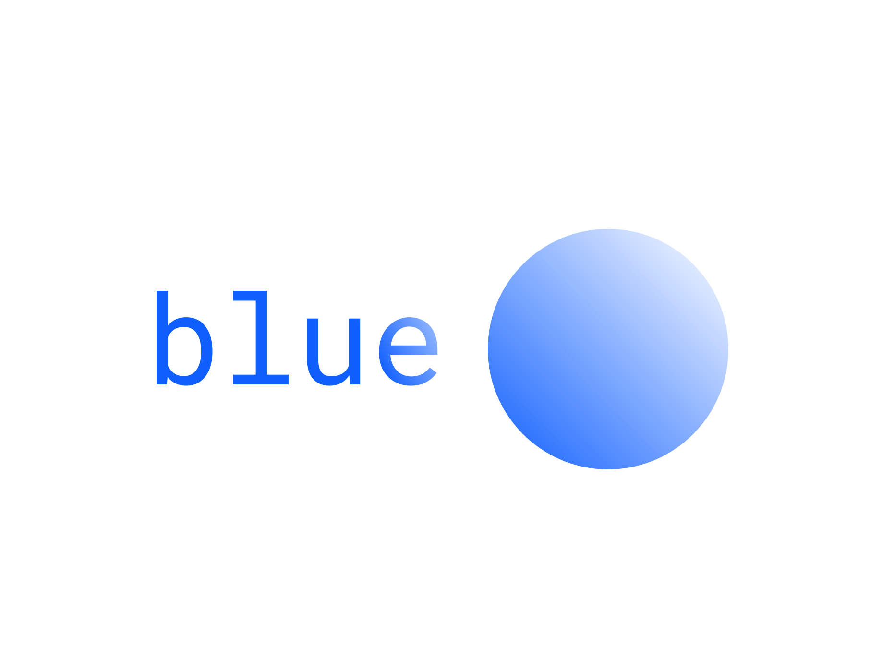

# blue 🔵 chat

The "chat" for Scratch.

The client runs in go, and the Scratch client is in files under the name [blue.sb3](blue.sb3).
You can import it to either Turbowarp or Scratch and use it using the project ID, and changing it in the [main.go](main.go) file

You can try the game directly on [Scratch project page](https://scratch.mit.edu/projects/1366075816/), just hit the full screen button and the Green flag, and you are ready to chat!

This project is very vague and perhaps only a start, I will also provide info in a new file describing how to do this in a general language (not only Go, like this' source code), sort of a pseudo-code, so that everyone can implement it.

#### Here's the file:
[how-it-works.md](how-it-works.md)

## Message encoding

Scratch allows only numbers to be sent over on cloud variables (probably to make it harder to send whole strings/text/characters, and thus harder to make chats).
I had implemented following method:

Lets say you write "test" and send it, which I then parse it letter by letter.
To separate letter by letter to be decoded, so I select 2 and 2 new numbers:
I made an variable which stores all possible letters people can use ("abcdefghijklmnopqrstuvwxyzæøåABCDEFGHIJKLMNOPQRSTUVWXYZÆØÅ1234567890"), so lets say i parse first "t", i find the index of letter "t" in the letters-variable, which will be 20, i then add it to the variable which the rest of the encoded characters (which are numbers). Next "e", this one isn't easy to encode because it got one digit contrary to the 2 digits all numbers have from 10 and above. So i add 0 infront of the number and push it together to the variable of encoded chars.

So test will be encoded to 20051920, with 20 being t, 05 being same as 5 whihch is e and, 19 which will be s. 

Decoding works similary but backwards, so i receive a long chain of numbers, and i decode 2 by 2, resulting in a letter by letter.

### **Licensed under MIT license, cause I like it to make my code open :)**

